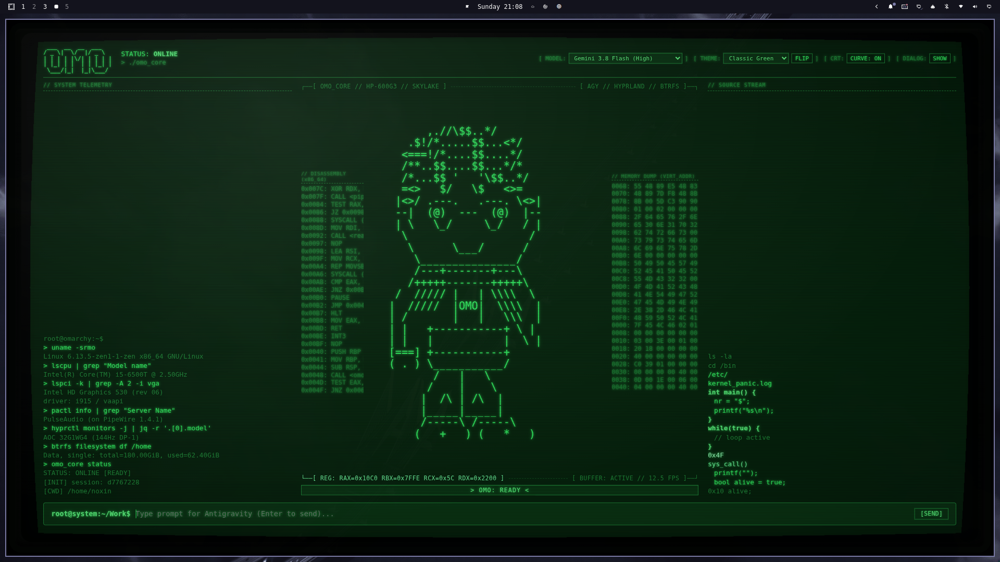

# omo-terminal

A retro green-phosphor CRT desktop front-end for **Google Antigravity** (`agy`), featuring an animated code-composed **Omo** mascot, live background code streaming, barrel-curved CRT display, and a vintage TV monitor chassis.



## Features

- **Retro CRT Display & Shader**: Authentic P1 phosphor aesthetic with hardware-accelerated barrel distortion, scanlines, vignette, and phosphor persistence in WebGL, wrapped in an obsidian TV monitor chassis. Includes a safe-area inset system preventing UI clipping when barrel curvature is active.
- **Dynamic CRT Phosphor Schemes**: Switch between 7 authentic palettes (`Classic Green`, `Amber Phosphor`, `Cyberpunk Cyan`, `Tokyo Night`, `Blood Matrix`, `Synthwave 84`, and `OS Default`). Press `F2` or `Alt+T` to quick-flip between Classic Green and your live Omarchy system theme.
- **Animated Omo Mascot**: Monospace ASCII character in the center matching the reference concept art with procedural facial articulation (blinking, saccades, talking mouth flaps, thinking gaze) and functional arm postures:
  - Reading files -> holding glowing CRT datasheet.
  - Writing code -> etching code with flying sparks.
  - Shell / commands -> typing on a glowing mini terminal.
  - Grep / search -> rotating radar sweep.
  - Idle -> hands resting in kangaroo pouch with foot tapping.
- **Dual Telemetry Columns**:
  - Left column: Omarchy system specs, hardware telemetry, and live-streaming x86_64 disassembly.
  - Right column: Virtual memory hex dump and source streams synchronized with Omo's animation clock.
- **Teletype BBS Dialogue Console**: Expandable teletype dialogue drawer that streams full assistant responses smoothly with copy-to-clipboard support.
- **Antigravity CLI Integration**: Direct NDJSON connection to `agy` via `--input-format stream-json --output-format stream-json`.
- **Multi-Model Dropdown**: Query and switch active models on the fly (Gemini 3.8 Flash, Gemini 3.7 Flash, Gemini 3.1 Pro, Claude Sonnet, Claude Opus, and GPT-OSS).
- **Skylake iGPU Optimized**: Calibrated for low-power Intel HD 530 graphics on the HP ProDesk 600 G3 DM. Single-pass WebGL shader with pure CSS low-power fallback.

## Quick Start

```bash
./install.sh
omo-terminal
```

## Keybindings

| Key | Action |
| --- | --- |
| `Enter` | Send prompt to Antigravity |
| `Up` / `Down` | Navigate prompt history |
| `Ctrl+C` | Interrupt running model turn |
| `Escape` | Toggle / dismiss BBS dialogue drawer |
| `F2` / `Alt+T` | Quick-flip between Classic Green and OS Default theme |

## License

[MIT](LICENSE) © 2026 xn0xinx
